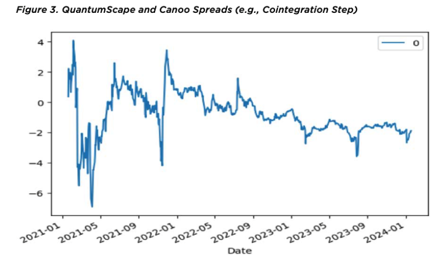

# Mean Reversion Statistical Arbitrage

## Project Overview
In this project, I scrutinize various techniques used in time series analysis to better suit 
quantitative analysis on financial data to perform mean reversion statistical arbitrage
and note the implications of using different techniques including linear and non-linear
approaches.  I then provide a demonstration of using cointegration to improve stationarity
of the model to provide more robust models.  

## Project Paper
Here is a link to my paper covering an overview of the project background, methods, and results:
https://github.com/jameshopham/Mean-Reversion-Statistical-Arbitrage/blob/main/WP2024.pdf

### Built With

This project was built with the following technologies:

- Python
- NumPy
- Pandas
- statsmodels
- datetime

## References
Here is some literature that may be helpful:

1. Boguslavskaya, E., Boguslavsky, M., & Muravey, D. (2020). Trading Multiple Mean
Reversion. Brunel University London, UK; TradeTeq, UK; Lomonosov State University,
Moscow, Russia
2009.09816.pdf
2. Chan, E. P. (2008). Quantitative Trading: How to Build Your Own Algorithmic Trading
Business. Wiley.
3. Chan, E. P. (2013). Algorithmic Trading: Winning Strategies and Their Rationale. Wiley.
4. Guijarro-Ordonez, J., Pelger, M., & Zanotti, G. (2022, September 25). Deep Learning
Statistical Arbitrage.
2106.04028.pdf
5. Hyndman, R. J., & Athanasopoulos, G. (2021). Forecasting: Principles and Practice (3rd
ed.). Otexts.
6. Kahneman, Daniel. Thinking, Fast and Slow. New York: Farrar, Straus and Giroux. 2011.
7. Khandani, Amir, and Andrew Lo. “What Happened to the Quants in August 2007?”
Preprint, 2007. Available at http://web.mit.edu/alo/www /Papers/august07.pdf.
8. Lo, Andrew W., and A. Craig MacKinlay. A Non-RandomWalk Down Wall Street.
Princeton, NJ: Princeton University Press, 2001.
9. Schoenberg, Ron, and Alan Corwin. “Does Averaging-in Work?” 2010.

## Contact

If you have any questions or suggestions, feel free to reach out to me:

- Connect with me on LinkedIn:

    
     
    <a href="https://www.linkedin.com/in/james-hopham-2440352a5/" target="_blank">James Hopham</a>
